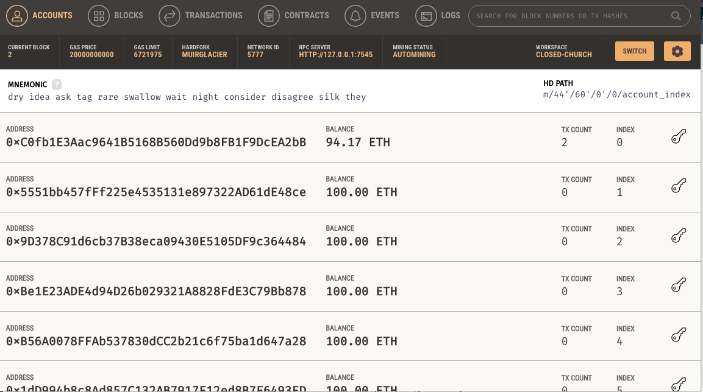

# Krypto Jobs 

## In this repo I use the python libraries streamlit, Web3 as well as the program Ganache to create a hiring board application that pays Fintech Professionals in ETH. 
 

### Here we see the balances of the ETH addresses created by the Ganache program

 

### These are the transactions that took place using the streamlit web application and stored on the Ganache program blockchain
### The address 0xC0fb1E3Aac9641B5168B560Dd9b8FB1F9DcEA2bB is the employer's address

 

### Here we see the employer's address send a wage payment to Ash at the address 0x2422858F9C4480c2724A309D58Ffd7Ac8bF65396

 

### This is another transaction were the employer sends a wage payment to Lane's address, 0xaC8eB8B2ed5C4a0fC41a84Ee4950F417f67029F0

